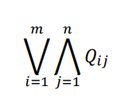

# LeIA - Teoría - Clase 1: Lógica proposicional

> Enlace: https://drive.google.com/file/d/1YLIjtuKjSUyHAH1uGaPimMdLb6FoKFaD/view

## Interpretación y satisfacción 

Una **interpretación** es una función que vincula los dominios sintáctico y semántico de la lógica considerada.
En el caso de la lógica proposicional, una interpretación es una _función de valuación_ que asigna un valor de verdad a cada variable de enunciado.  

Las reglas semánticas extienden esta valuación a todas las fórmulas bien formadas (fbfs). Por ejemplo, |=v p si y solo si v(p) = V. Cada fila de una tabla de verdad representa una valuación diferente.

`|=v (A∧B) si y sólo sí |=v A y |=v B` se puede escribir así: `v(A∧B)=V si y sólo sí v(A)=V y v(B)=V`. La primera parte se lee: la valoración de A∧B es verdadero si y sólo si la valoración de A es verdadera y la valoración de B es verdadera.

> El símbolo |= hace referencia a la semántica en Lógica 

## Tautología y contradicción
Una fbf es una **tautología** si siempre toma el valor de verdad V para _todas_ las posibles asignaciones de verdad a sus variables de enunciado. Un ejemplo es `(p ∨ (¬p))`. 
Una fbf es una **contradicción** si _siempre_ toma el valor de verdad F. Un ejemplo es `(p ∧ (¬p))`

Tanto en el caso de una tautología como contradicción dos fbf comparten la tabla de verdad, tienen diferente sintáctica pero semánticamente tienen la misma función de verdad. 

## Equivalencias lógicas
Sean A y B dos enunciados, se dice que A es lógicamente equivalente a B (A ⇔ B) si la forma enunciativa A↔B (bicondicional) es una tautología. 

Ejemplos notables incluyen las **Leyes de De Morgan**: `¬(p ∨ q) ⇔ (¬p) ∧ (¬q)` y `¬(p ∧ q) ⇔ (¬p) ∨ (¬q)`

## Implicación lógica 
A implica lógicamente a B o que B es consecuencia lógica de A (A ⇒ B) si la forma enunciativa A → B es una tautología. 
Por ejemplo, p ∧ q implica lógicamente a p. 

### Formas normales 
La forma normal se refiere a una estructura estandarizada para las fórmulas bien formadas que utiliza un conjunto restringido de conectivas lógicas. Una fórmula bien formada que no es una contradicción es lógicamente equivalente a una forma enunciativa restringida de la forma: 

donde cada Qij es una variable de enunciado o la negación de una variable. 

## Conjuntos adecuados de conectivas 
Conjunto tal que toda función de verdad puede representarse por medio de una forma enunciativa en la que sólo aparezcan conectivas de dicho conjunto. 
Ejemplos de conjuntos adecuados de dos elementos son {¬, ∧}, {¬, ∨} y {¬, →}.

➢ (A ∨ B ) equivalente a  ~ (~A ∧ ~B)
➢ (A ∧ B ) equivalente a   ~ (~A ∨ ~B)
➢ (A ∧ B ) equivalente a ~(A → ~B)
➢ (A → B ) equivalente a ~A ∨ B
➢ (A → B ) equivalente a  ~(A ∧ ~B) 

También existen conjuntos unitarios adecuados, como el operador NAND (|) y el operador NOR (↓), que por sí solos pueden expresar cualquier función de verdad.

## Argumentaciones
Se puede reescribir con estos conceptos las argumentaciones:
La forma argumentativa $A_1$, $A_2$, ..., $A_n$ ... $A$ es válida si y sólo si la *forma enunciativa* $A_1$ ∧ $A_2$ ∧ ... ∧ $A_n$ → A es una tautología, es decir, si y sólo si la conjunción de las premisas implican lógicamente a la conclusión. 
La notación Γ |= A se usa para indicar que "Γ implica lógicamente a A" o "A se deduce de Γ", donde Γ es un conjunto de premisas.